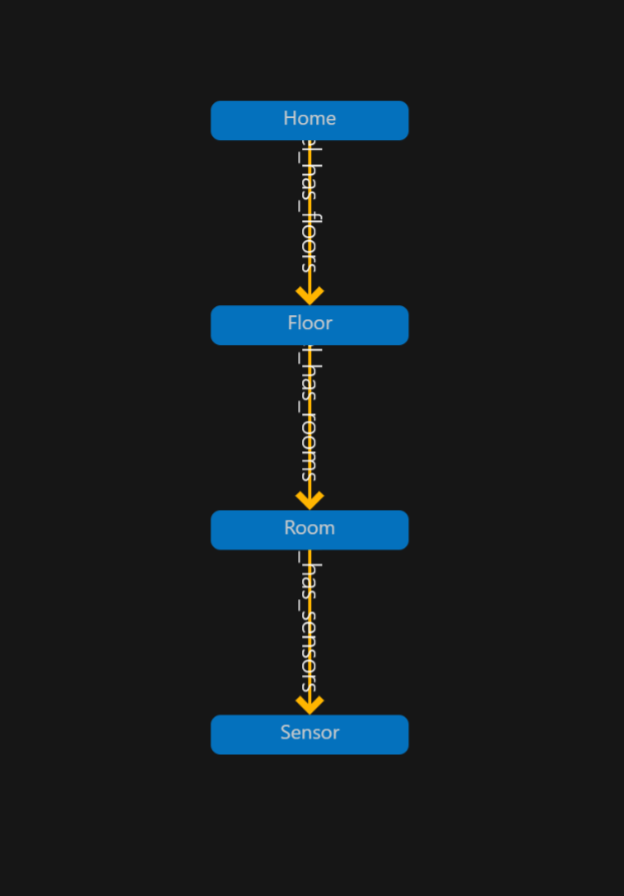
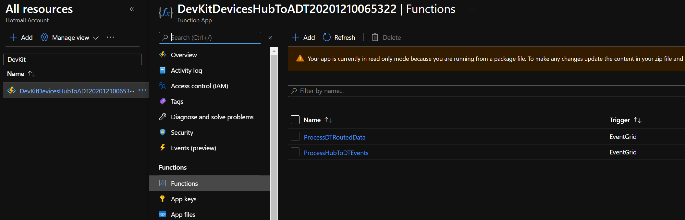

# Create your first an Azure Digital Twins app

Want to learn how to connect telemetry that comes from physical devices and create digital representations of them using Azure Digital Twins? In this repo we put together all the assets you need to create a simple solution using Azure Digitial twins with physicall IoT Devkit devices.

The repo contains:

- Azure Digital Twin models
- Import file to import a sample Azure Digital Twin graph
- Azure Function to connect IoT Hub messages to Azure Digital Twins
- Client react based web app to show the status of your house, floor, rooms, and sensors

## Scenerio

We are using a smart home as our example scenario. Our house has floors, rooms, and sensors. We want to track the temperature and humidity data at the rooma and floor level.

## Getting started

There are multiple pieces that you need to put into place. These include:

1. Create an Azure IoT Hub instance
2. Connect IoT DevKit devices to IoT Hub
3. Create an Azure Digital Twins instance
4. Import models into your Azure Digital Twins instance
5. Create a twins graph to represent your home
6. Publish Azure Function to route messages from IoT Hub into Azure Digital Twins
7. Run react-app 

### 1. Create an Azure IoT Hub instance

[Create an IoT hub using the Azure portal](https://docs.microsoft.com/en-us/azure/iot-hub/iot-hub-create-through-portal)

### 2. Connect IoT DevKit AZ3166 to Azure IoT Hub

[Connect IoT DevKit AZ3166 to Azure IoT Hub](https://docs.microsoft.com/en-us/azure/iot-hub/iot-hub-arduino-iot-devkit-az3166-get-started)

If you don't have any physical devices, you can simulate the sensor data using the `env-sensor.js` file. Detailed instructions can be found in the [simulated-client folder](./simulated-client).

Once you setup your devices, you should see telemetry data start flowing into IoT Hub almost immediately. To see the telemetry messages you can run the follow command in [Azure Cloud Shell](https://shell.azure.com/).

```
az iot hub monitor-events -n <IoT-hub-name> -t 0
```

### 3. Create an Azure Digital Twins instance

[Set up an Azure Digital Twins instance and authentication (portal)](https://docs.microsoft.com/en-us/azure/digital-twins/how-to-set-up-instance-portal)

### 4. Import models into your Azure Digital Twins instance

Using [Azure Digital Twins Explorer](https://docs.microsoft.com/en-us/azure/digital-twins/quickstart-azure-digital-twins-explorer) import the modles location in the [models](./models) folder.

Once you import, your model graph should look like this:



### 5. Create twins graph

Now that we have our models imported into the Azure Digital Twins instance, we need to create a twin graph the represents our home. You will need to create twins for your Home, Floors, Rooms and Sensors. 

Again, use [Azure Digital Twins Explorer](https://docs.microsoft.com/en-us/azure/digital-twins/quickstart-azure-digital-twins-explorer) to create the twins and relationships.

Here is an example:


> It is important to note that the sensor names shoud match the names of the sensors you registered in IoT Hub. If the names do not match, the telemetry values cannot flow into your digital twins.

### 6. Publish Azure Function

In order to get the data from IoT Hub into Azure Digital Twins, we need to use an Azure Function. We also have a secondary function that is used to update average temperatures for a Floor.

Using the functions in this repo, follow the instructions to [Publish the function app to Azure](https://docs.microsoft.com/azure/digital-twins/how-to-create-azure-function?tabs=cli#publish-the-function-app-to-azure) as well as [setting up security access](https://docs.microsoft.com/en-us/azure/digital-twins/how-to-create-azure-function?tabs=cli#set-up-security-access-for-the-function-app).

Once you have completed the steps, you should the Azure Function in the Portal with the two function names.



At this point you should start seeing data flowing from IoT Hub into your digital twins. Again, you can use a CLI command to monitor the functions activity.

```
az webapp log tail –name <function-name> --resource-group <resource-group-name>
```

### 7. Run react-app 

Now that the telemetry from the devices are updating your digital twins, we can run our client app built on top of the Azure Digital Twins platform.

```
cd apps\client-app-rect
```

```
npm install
npm start
```


